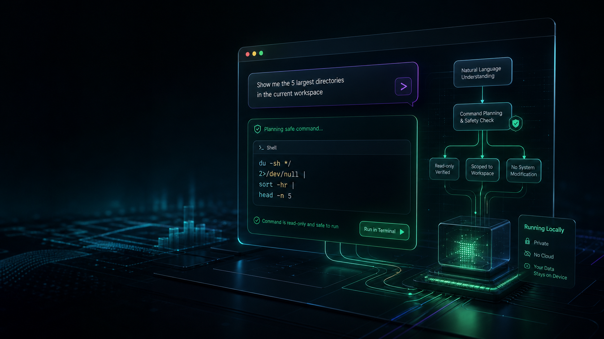
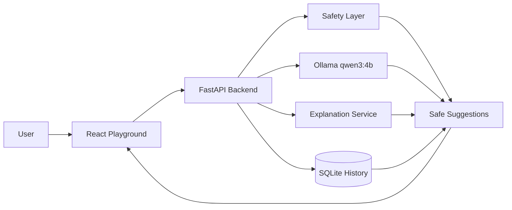

# CmdPilot


CmdPilot is an AI-powered terminal assistant that converts natural language into safe,
explainable terminal commands. It is built as a production-style full-stack project with
React, Vite, TailwindCSS, FastAPI, SQLite, Pydantic, Ollama, Docker, CI/CD, and deployment
configuration for Vercel and Render.

CmdPilot never executes commands automatically. Every command must be reviewed and confirmed
by the user.

## Features

- Natural-language command generation with local Ollama support
- Multiple command suggestions for Windows, Linux, and macOS
- Safety layer that blocks dangerous commands like `rm -rf`, `del /f`, `format`, `shutdown`, and `reboot`
- Command explanations before execution
- SQLite command history with prompt, command, platform, timestamp, and success status
- FastAPI REST API
- Dark, responsive React product UI with a playground
- Docker, GitHub Actions, pre-commit hooks, Render, and Vercel configs

## Screenshots

Add product screenshots in `screenshots/` after running the app locally.



## Demo

Demo GIF placeholder:

```text
screenshots/demo.gif
```

Suggested flow:

```text
Ask: how to list all files with details
Suggested command: ls -la
Execute? [Yes] [No]
```

## Tech Stack

| Layer | Technology |
| --- | --- |
| Frontend | React, Vite, TypeScript, TailwindCSS, Framer Motion, shadcn-style UI |
| Backend | Python, FastAPI, Pydantic, SQLite |
| AI | Ollama with `qwen3:4b` |
| DevOps | Docker, GitHub Actions, pre-commit |
| Deployment | Vercel frontend, Render backend |

## Architecture



## Installation

Install Ollama and pull the local model:

```powershell
ollama pull qwen3:4b
```

Run the backend:

```powershell
cd backend
python -m venv .venv
.\.venv\Scripts\activate
pip install -r requirements.txt
uvicorn app.main:app --reload
```

Run the frontend:

```powershell
cd frontend
npm install
npm run dev
```

Open:

```text
http://localhost:5173
```

## API Reference

### `POST /generate-command`

```json
{
  "prompt": "show all files",
  "platform": "windows",
  "max_suggestions": 3
}
```

### `POST /explain-command`

```json
{
  "command": "dir"
}
```

### `GET /history`

Returns the latest 100 command history records.

### `DELETE /history`

Clears local command history.

## Docker

```powershell
docker compose up --build
```

Frontend: `http://localhost:5173`
Backend: `http://localhost:8000`

## Deployment

Frontend on Vercel:

- Root directory: `frontend`
- Build command: `npm run build`
- Output directory: `dist`
- Environment variable: `VITE_API_URL=https://your-render-service.onrender.com`

Backend on Render:

- Root directory: `backend`
- Build command: `pip install -r requirements.txt`
- Start command: `uvicorn app.main:app --host 0.0.0.0 --port $PORT`
- Environment variables:
  - `CMDPILOT_OLLAMA_MODEL=qwen3:4b`
  - `CMDPILOT_DATABASE_URL=/var/data/cmdpilot.db`

## Future Scope

- User accounts and cloud sync
- Shell profile detection
- Rich terminal UI package
- Command risk scoring
- Saved workflows and team command snippets
- Hosted model provider fallback

## Contributing

See [CONTRIBUTING.md](CONTRIBUTING.md).

## License

MIT. See [LICENSE](LICENSE).
