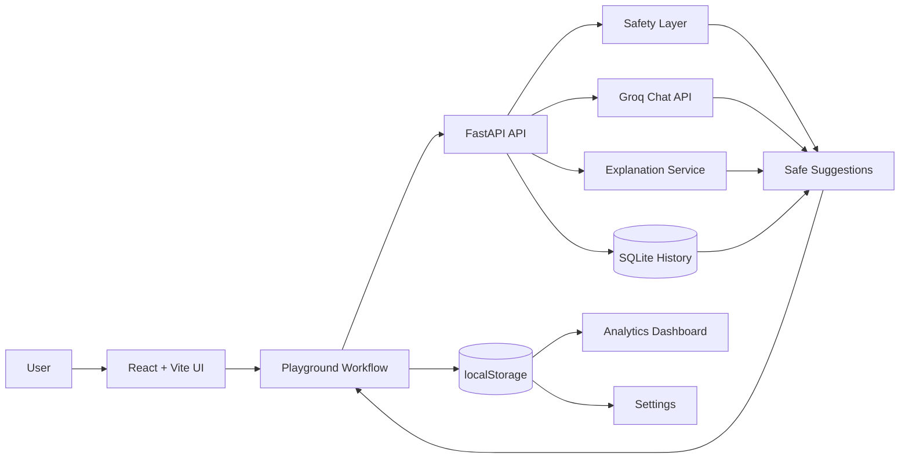

# CmdPilot


CmdPilot is a production-style AI terminal assistant that converts natural language into safe, explainable terminal commands for Windows, Linux, and macOS.

It is designed as a polished full-stack portfolio project: React, TypeScript, Vite, TailwindCSS, FastAPI, SQLite, Pydantic, Groq, local analytics, and deployment-ready configs for Vercel and Render.

CmdPilot never runs commands automatically. Every generated command is reviewed, explained, checked for destructive patterns, and confirmed by the user through a mocked terminal preview.

## Features

- Natural-language command generation with Groq API support
- Windows, Linux, and macOS command suggestions
- Safety warnings and destructive command blocking
- Loading spinner, thinking state, and skeleton suggestion cards
- Empty state with clickable prompt examples
- Redesigned command cards with code blocks, syntax highlighting, copy, execute preview, warnings, and safety badges
- Local command history with re-run, delete, clear, search, import, export, favorites, and pinned commands
- Keyboard shortcuts: Enter to generate, Ctrl+Enter to generate and focus results, Esc to clear
- Terminal preview modal with mocked output
- Local analytics dashboard for searches, commands generated, platform usage, top query, and blocked command count
- Settings page for dark mode, light mode, auto-copy, save history, and preferred platform
- Responsive navigation and collapsible mobile history sidebar
- Accessible controls with ARIA labels, focus rings, keyboard navigation, and screen reader status messaging
- Backend health checks, CORS config, SQLite history, and deployment-friendly environment variables

## Screenshots

Add current screenshots after deployment:

```text
screenshots/home.png
screenshots/playground.png
screenshots/dashboard.png
screenshots/settings.png
screenshots/terminal-preview.png
```

## Tech Stack

| Layer | Technology |
| --- | --- |
| Frontend | React 19, TypeScript, Vite, TailwindCSS, Lucide React |
| Backend | Python, FastAPI, Pydantic, SQLite |
| AI | Groq API |
| Persistence | SQLite on backend, localStorage for portfolio UI preferences/history/analytics |
| Quality | Pytest, Ruff, ESLint, TypeScript build |
| Deployment | Vercel frontend, Render backend |

## Architecture



## Local Development

### Backend

```powershell
cd backend
python -m venv .venv
.\.venv\Scripts\activate
pip install -r requirements.txt
uvicorn app.main:app --reload
```

Backend URL:

```text
http://localhost:8000
```

API docs:

```text
http://localhost:8000/docs
```

### Frontend

```powershell
cd frontend
npm install
npm run dev
```

Frontend URL:

```text
http://localhost:5173
```

## Environment Variables

### Backend

| Variable | Required | Description |
| --- | --- | --- |
| `CMDPILOT_GROQ_API_KEY` | Production | Groq API key used for command generation |
| `CMDPILOT_GROQ_MODEL` | Optional | Groq model name, defaults to `llama-3.1-8b-instant` |
| `CMDPILOT_DATABASE_URL` | Optional | SQLite database path, defaults to `./cmdpilot.db` |
| `CMDPILOT_ALLOWED_ORIGINS` | Optional | Allowed CORS origins |

If `CMDPILOT_GROQ_API_KEY` is missing, CmdPilot falls back to deterministic safe command templates for supported intents.

### Frontend

| Variable | Required | Description |
| --- | --- | --- |
| `VITE_API_URL` | Production | Render backend URL, for example `https://cmdpilot-api.onrender.com` |

## API Reference

### `GET /`

Returns API metadata and useful links.

### `GET /health`

```json
{
  "status": "ok"
}
```

### `POST /generate-command`

```json
{
  "prompt": "find files larger than 100MB",
  "platform": "windows",
  "max_suggestions": 3
}
```

### `POST /explain-command`

```json
{
  "command": "dir /a"
}
```

### `GET /history`

Returns the latest command generation records stored by the backend.

### `DELETE /history`

Clears backend command history.

## Deployment

### Vercel Frontend

- Root directory: `frontend`
- Install command: `npm install`
- Build command: `npm run build`
- Output directory: `dist`
- Environment variable: `VITE_API_URL=https://your-render-service.onrender.com`

### Render Backend

- Root directory: `backend`
- Build command: `pip install -r requirements.txt`
- Start command: `uvicorn app.main:app --host 0.0.0.0 --port $PORT`
- Environment variables:
  - `CMDPILOT_GROQ_API_KEY`
  - `CMDPILOT_GROQ_MODEL=llama-3.1-8b-instant`
  - `CMDPILOT_DATABASE_URL=/var/data/cmdpilot.db`
  - `CMDPILOT_ALLOWED_ORIGINS=["https://your-vercel-app.vercel.app"]`

## Quality Checks

Backend:

```powershell
cd backend
..\venv\Scripts\python.exe -m pytest
..\venv\Scripts\python.exe -m ruff check .
```

Frontend:

```powershell
cd frontend
npm run lint
npm run build
```

## Project Structure

```text
backend/
  app/
    api/            FastAPI routes
    database/       SQLite connection and repository
    models/         Pydantic schemas
    services/       generation, explanation, safety
    utils/          environment config
frontend/
  src/
    components/     reusable UI, command cards, history, terminal preview
    hooks/          localStorage and settings hooks
    lib/            API client, storage helpers, shared types
    pages/          app shell, playground, dashboard, settings, docs, about
```

## Contributing

1. Create a branch from `main`.
2. Keep frontend changes typed and componentized.
3. Add or update tests when backend behavior changes.
4. Run the quality checks before opening a pull request.
5. Keep command safety conservative. Destructive commands should be blocked or require explicit review.

See [CONTRIBUTING.md](CONTRIBUTING.md) for the full guide.

## Roadmap

- User accounts and cloud sync
- Shell profile detection
- Command risk scoring with severity levels
- Saved workflows and reusable command recipes
- Team command snippets
- Real terminal sandbox integration
- Hosted demo video and fresh screenshots
- Optional model provider fallback

## License

MIT. See [LICENSE](LICENSE).
