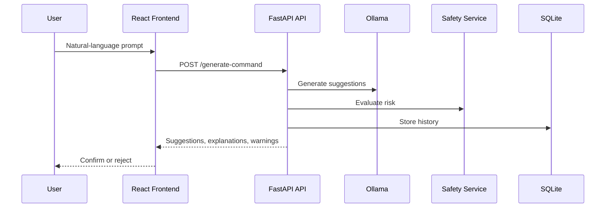

# Architecture

```mermaid
sequenceDiagram
    participant U as User
    participant F as React Frontend
    participant A as FastAPI API
    participant O as Ollama
    participant S as Safety Service
    participant D as SQLite

    U->>F: Natural-language prompt
    F->>A: POST /generate-command
    A->>O: Generate suggestions
    A->>S: Evaluate risk
    A->>D: Store history
    A-->>F: Suggestions, explanations, warnings
    F-->>U: Confirm or reject
```

CmdPilot keeps execution human-in-the-loop. The backend generates and evaluates command
suggestions, while the frontend only simulates confirmation controls.
